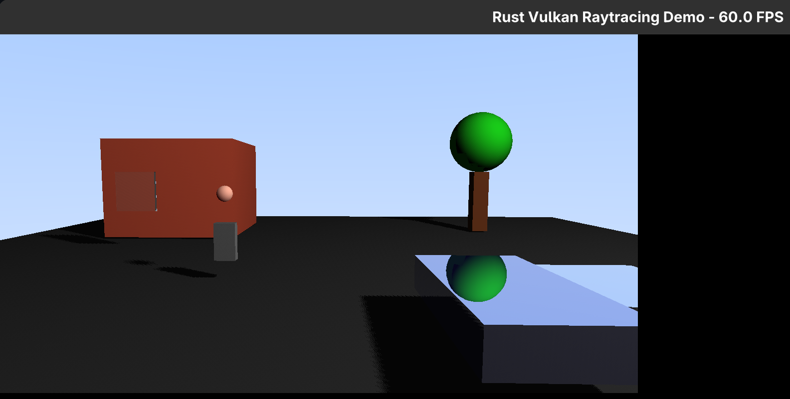

# Rust Vulkan Raytracing Demo

This project is a real-time raytracing demonstration written in Rust using the Vulkan API (via `ash`). It implements a fully ray-traced pipeline using `VK_KHR_ray_tracing_pipeline` to render a friendly neighborhood scene.



## Features

The demo showcases several raytracing effects, which can be toggled dynamically:

*   **Soft Shadows**: Ray-traced shadows with stochastic light sampling for soft penumbras.
*   **Reflections**: Recursive ray tracing for metallic surfaces (e.g., the car).
*   **Refractions**: Recursive ray tracing for dielectric materials (e.g., windows, puddle) with simplified Fresnel.
*   **Subsurface Scattering (Approximated)**: A simple approximation for the person's skin.

## Scene Description

The scene is constructed programmatically and includes:

*   **House**: Brick texture with glass windows.
*   **Tree**: Bark trunk with green foliage.
*   **Car**: Metallic blue finish.
*   **Person**: Simple geometric representation.
*   **Environment**: Asphalt road and a water puddle.

## Controls

*   **Mouse**: Look around (FPS style).
*   **W / A / S / D**: Move camera horizontally.
*   **Q / E**: Move camera Up / Down.
*   **1**: Toggle **Soft Shadows**.
*   **2**: Toggle **Reflections**.
*   **3**: Toggle **Refractions**.
*   **4**: Toggle **Subsurface Scattering**.
*   **Esc**: Exit the application.

## Prerequisites

*   **OS**: Linux or Windows recommended. macOS has **limited support** (see macOS section below).
*   **GPU**: NVIDIA RTX 2060 or newer, or AMD RDNA2+ (RX 6000 series or newer) with Vulkan Ray Tracing support.
    *   **Note**: Hardware ray tracing requires specific GPU extensions. Integrated GPUs typically do not support ray tracing.
*   **Drivers**: Latest GPU drivers with Vulkan 1.2+ and Ray Tracing extensions support.
*   **Rust**: Latest stable toolchain (install via [rustup.rs](https://rustup.rs)).
*   **Vulkan SDK**: Recommended for shader compilation tools (`glslc`), though this project uses `shaderc` to compile shaders at runtime.

## Build & Run

### Linux

1.  **Clone the repository:**
    ```bash
    git clone https://github.com/your-username/rust-raytracing.git
    cd rust-raytracing
    ```

2.  **Run with Cargo:**
    ```bash
    cargo run --release
    ```
    *Note: The `--release` flag is highly recommended for performance.*

### Windows

1.  **Prerequisites:**
    *   Install [Visual Studio 2019 or 2022](https://visualstudio.microsoft.com/) with the "Desktop development with C++" workload
    *   Install [CMake](https://cmake.org/download/) (required for building shaderc from source)
    *   Install [Python 3](https://www.python.org/downloads/) (required for shaderc build scripts)
    *   Install the [Vulkan SDK](https://vulkan.lunarg.com/) for Windows
    *   Install Rust via [rustup.rs](https://rustup.rs) using the MSVC toolchain

2.  **Clone the repository:**
    ```powershell
    git clone https://github.com/your-username/rust-raytracing.git
    cd rust-raytracing
    ```

3.  **Build and run:**
    ```powershell
    cargo run --release
    ```

**Windows Build Notes:**
- The project builds shaderc from source with dynamic CRT (/MD) to match Rust's default CRT linkage
- First build will take longer (5-10 minutes) as it compiles the shaderc C++ library
- The `.cargo/config.toml` and `build.rs` configure the correct CRT settings automatically
- If you encounter linker errors:
  - Run `cargo clean` to remove any cached builds with wrong CRT settings
  - Ensure Visual Studio C++ tools and CMake are properly installed
  - Check that Python 3 is available (required for shaderc build)

### macOS (Limited Support)

**IMPORTANT**: macOS does not support native Vulkan. Ray tracing support is **extremely limited** or unavailable.

1.  **Install MoltenVK** (Vulkan to Metal translation layer):
    ```bash
    # Via Homebrew
    brew install molten-vk

    # Or download Vulkan SDK from https://vulkan.lunarg.com/sdk/home#mac
    ```

2.  **Set environment variables**:
    ```bash
    export VULKAN_SDK="/usr/local"  # Or your Vulkan SDK path
    export DYLD_LIBRARY_PATH="$VULKAN_SDK/lib:$DYLD_LIBRARY_PATH"
    export VK_ICD_FILENAMES="$VULKAN_SDK/share/vulkan/icd.d/MoltenVK_icd.json"
    export VK_LAYER_PATH="$VULKAN_SDK/share/vulkan/explicit_layer.d"
    ```

3.  **Build and run**:
    ```bash
    cargo run --release
    ```

**Expected Limitations on macOS:**
- Ray tracing extensions (`VK_KHR_ray_tracing_pipeline`, `VK_KHR_acceleration_structure`) are **not supported** by MoltenVK
- You will likely see: `ERROR_INCOMPATIBLE_DRIVER` or "No suitable GPU found"
- This demo requires hardware ray tracing, which is only available on Windows and Linux with compatible GPUs

## Project Structure

*   `src/main.rs`: Application entry point. Sets up the window and event loop.
*   `src/renderer.rs`: The core rendering engine. Handles Vulkan initialization, resource management (buffers, images), acceleration structure building (BLAS/TLAS), and the ray tracing pipeline setup.
*   `src/vulkan.rs`: Vulkan boilerplate and context creation (Instance, Device, Physical Device selection).
*   `src/scene.rs`: Defines the scene geometry (meshes) and materials.
*   `src/camera.rs`: Handles camera movement and view/projection matrix calculations.
*   `src/shaders/`: GLSL shader source files.
    *   `raygen.rgen`: Ray generation shader. Primary entry point for rays.
    *   `closesthit.rchit`: Closest hit shader. Handles material shading and recursive rays.
    *   `miss.rmiss`: Miss shader. Renders the sky background.
    *   `shadow.rmiss`: Shadow miss shader. Used for occlusion testing.

## Technical Details

*   **API**: Vulkan 1.2 via `ash` crate.
*   **Extensions Used**:
    *   `VK_KHR_ray_tracing_pipeline`
    *   `VK_KHR_acceleration_structure`
    *   `VK_KHR_deferred_host_operations`
    *   `VK_KHR_buffer_device_address`
*   **Math**: `glam` for linear algebra.
*   **Windowing**: `winit` for window creation and input handling.

## Troubleshooting

*   **"No suitable GPU found"**: Ensure you have a Vulkan-capable GPU and appropriate drivers installed. If on Linux, check `vulkaninfo`. On Windows, check `vulkaninfoSDK.exe` in your Vulkan SDK installation.
*   **Crashes on startup**: Check if your GPU supports Hardware Ray Tracing. Some older GPUs support Vulkan but not the specific Ray Tracing extensions required here.
*   **Shader compilation errors**: The project compiles shaders at runtime using `shaderc`. Ensure the `shaderc` build dependency can find the C++ libraries or built correctly. On Linux, you might need `cmake` and `python3` installed for the build script.
*   **Windows linker errors (LNK2019, LNK1120)**: These are CRT linkage errors. Solutions:
    *   Run `cargo clean` to clear any cached builds with incompatible settings
    *   Verify Visual Studio C++ tools are installed (needed for CMake builds)
    *   Check that you're using the MSVC toolchain: `rustup default stable-msvc`
    *   Ensure CMake is installed and in PATH (download from https://cmake.org)
    *   Ensure Python 3 is installed and in PATH (required for shaderc build)
    *   Ensure the Vulkan SDK is properly installed and `VULKAN_SDK` environment variable is set

## License

MIT License
